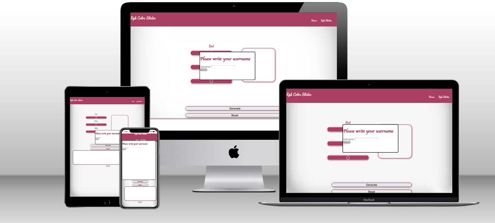
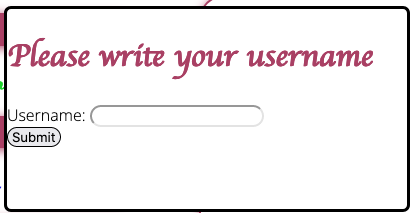
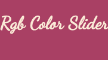
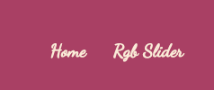
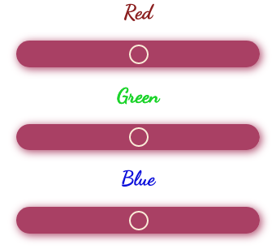
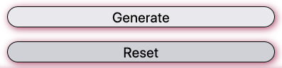
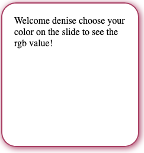
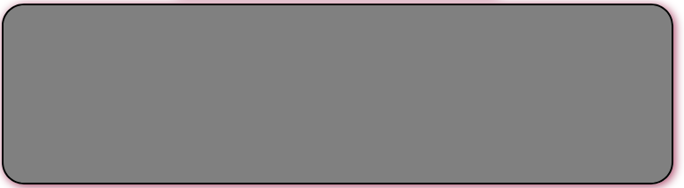
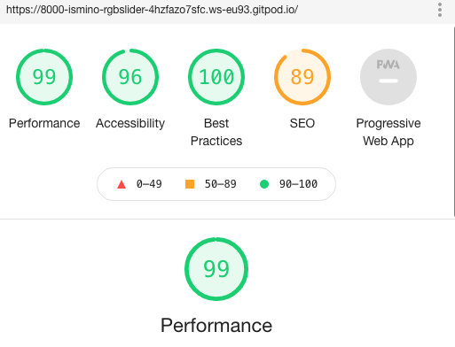
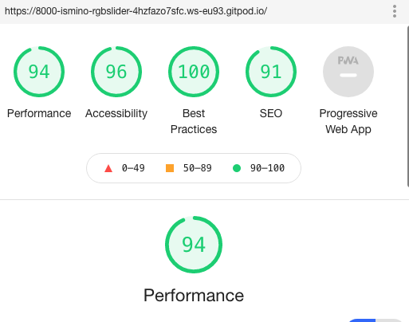

## RGB color slider website 

The website is designed to let the user pick and choose colors with a rgb slider. The user can generete the color choosen and see the rgb value to use in their code.

## Features

The website is aimed at professionals looking for rgb colors to work with. For exampel web designers or regular designers. When loading the page the user fills in their username and after that they see a welcome "" choose your color on the slide to see your rgb value. After choosing they can also reset the value and choose a new color. This way they can work with colors on a professional level. 

### Existing Features

__Pop up modal__

- Pop up modal for the user the put in their username.
- This part is requiered and if the user dont fullfil to fill in the username a text shows with the message "Username is required".
- After the user filled in the username the modal disapears.

__The logo__

- Simple logo with nice font. 

__Navigation bar__

- The navigation bar is simpel and has two choises. 
- By the help of the nav bar the user can simple navigate through the site.

__The Rgb slider section__

- The main function of the site is to choose and generate color values with RBG, therefore there is a slider where the user can slide to get an color displayed. 
- The color slider is made simple for the user to slide through.
- The color slide has three range slides, Red, Green and blue.
- When combining the three diffrent colors a color is displayn. 

__The generate and reset button__

- After choosen a color with the slider the user can click at the generate button.
- The generate button generates the rgb value of the color choosen and shows the value in a tablet.
- The user can also reset the value by clicking the reset button.

__The welcome and value tablet__

- A tablet that showes the saved username and displays it.
- Here the user can also see a saved rgb value code after clicking the generate button.
- The tablet is formed simple for the user to user to understand and use.

__The color display__

- The color display is where the user see's the color after/when sliding throght the rgb slider.
- The display is big and simple so the user can focus on choosing the color they want and likes.

## Testing

- I tested the RGB site on lighthouse for both desktop's and phones and it got very god results, the site works good. 
- The first picture is from lighthouse when testing the page for Desktops.
- The second picture is from lighthouse when testing the page for Phones.

### Validator testing 

- There were one thing that came up in the W3C validator testing for html, a warning that a section should contain a heading. [W3C validator](https://validator.w3.org/nu/#textarea)

- There were no found error's in the css code when testing through jigsaw css validator testing. [jigsaw validator](https://jigsaw.w3.org/css-validator/validator)

- When testing throght JSHint i get an error saying "const' is available in ES6 (use 'esversion: 6') or Mozilla JS extensions (use moz)." [JSHint validator](https://jshint.com/)

### Unfixed bugs 

- There is no known bugs.

## Deployment

- For the deployment process i went to github and to Rgb slider repositry and then to settings and pages. On pages i deployed the project and after a few secunds it went online.

## Credits 

- I give credits to https://m.youtube.com/watch?v=-55GRq-hUyE for the first part of my js work. I looked at his youtube video and followed some of his code sources. I learned through his video. 
- Also I give credit to the code institute tuturing that helpt me solve technichal issues.

## Content 

- The content was made by me, i only got help with some functinallity from the youtube video i refered to in the credit section. 

## Languages used

- I used only HTML,CSS and javascript.

## UX design

- I used a pink color with white, a simple design and Dancing script as font.

